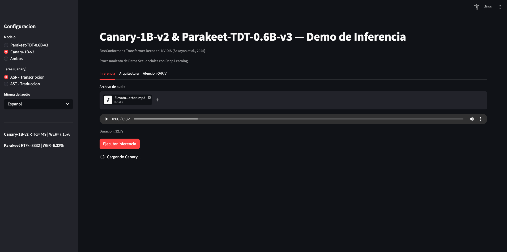
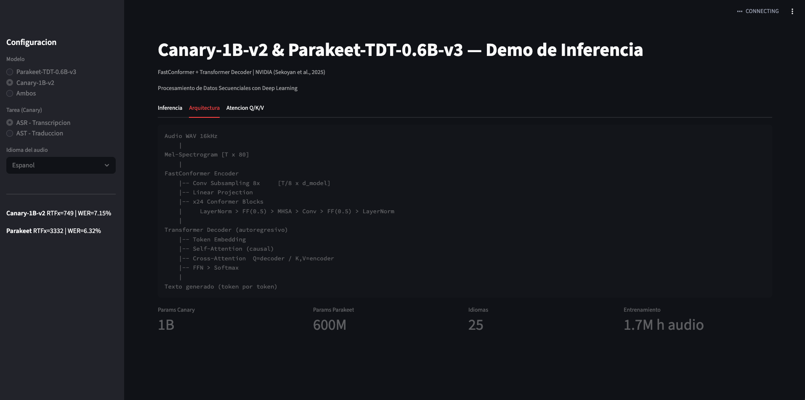
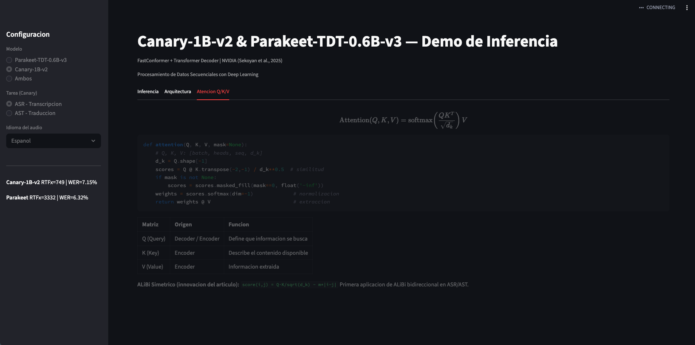
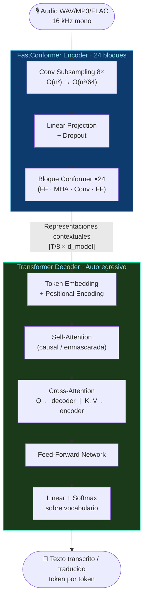
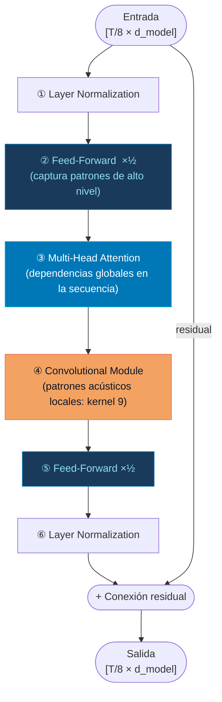
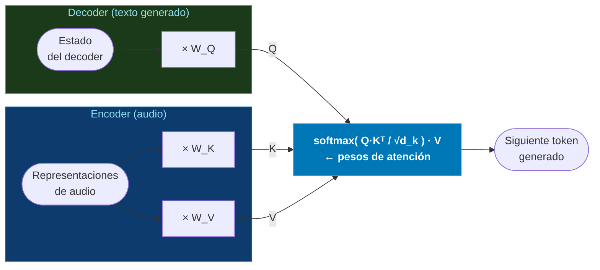
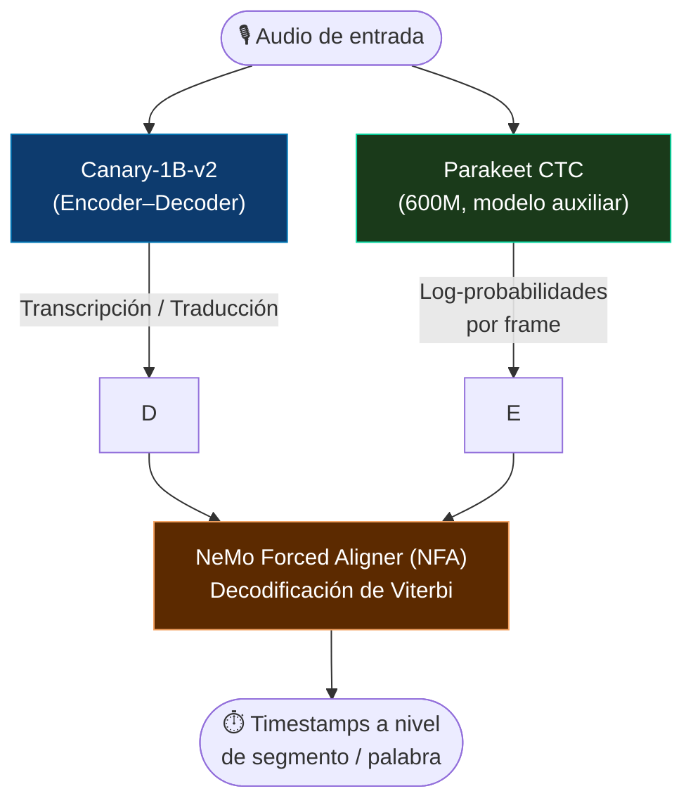
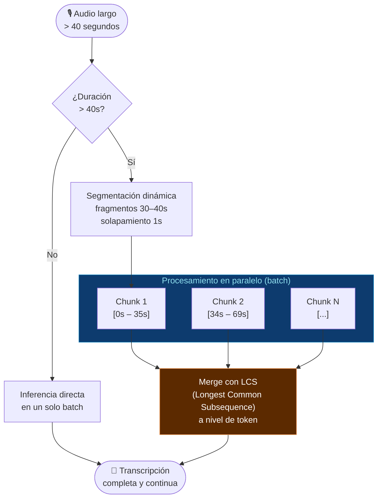

# Canary-1B-v2 & Parakeet-TDT-0.6B-v3: Inferencia con Transformer Encoder-Decoder para ASR y Traducción de Voz

**Materia:** Procesamiento de Datos Secuenciales con Deep Learning  
**Especialización:** Inteligencia Artificial y Aprendizaje Automático  
**Grupo:**

| Nombre | Código |
|--------|--------|
| Santiago Londoño Méndez | 22602902 |
| Andrés Rojas Zúñiga | 22507348 |
| Rubén Darío García Morales | 22507004 |
| David Ayala Caro | 22507570 |

---

## 1. Resumen (Abstract)

Este trabajo implementa inferencia funcional sobre dos modelos de reconocimiento automático de voz (ASR) y traducción de voz a texto (AST) de NVIDIA: **Canary-1B-v2** y **Parakeet-TDT-0.6B-v3**. Ambos modelos siguen la arquitectura Transformer encoder–decoder y soportan 25 idiomas europeos. El énfasis del proyecto está en comprender y explicar en profundidad la arquitectura FastConformer + Transformer decoder, el mecanismo de atención multi-cabeza y la generación de los tensores Q, K y V. Como resultado se implementó una interfaz interactiva en Streamlit que permite cargar un archivo de audio y visualizar en tiempo real la transcripción y/o traducción generada por el modelo. Los resultados demuestran que Canary-1B-v2 supera a Whisper-large-v3 en inglés siendo 10× más rápido (RTFx = 749), y Parakeet-TDT-0.6B-v3 alcanza RTFx = 3332 con un WER promedio del 6.32%.

---

## Capturas de pantalla

| Demo de Inferencia | Arquitectura | Atención Q/K/V |
|---|---|---|
|  |  |  |

---

## 2. Introducción

### Artículo base

> **Sekoyan, M., Koluguri, N. R., Tadevosyan, N., Zelasko, P., Bartley, T., Karpov, N., Balam, J., & Ginsburg, B. (2025). *Canary-1B-v2 & Parakeet-TDT-0.6B-v3: Efficient and High-Performance Models for Multilingual ASR and AST*. NVIDIA.**

- Artículo completo (PDF): [arxiv.org/pdf/2509.14128](https://arxiv.org/pdf/2509.14128)
- HuggingFace Papers: [huggingface.co/papers/2509.14128](https://huggingface.co/papers/2509.14128)
- Modelo Canary-1B-v2: [huggingface.co/nvidia/canary-1b-v2](https://huggingface.co/nvidia/canary-1b-v2)
- Modelo Parakeet-TDT-0.6B-v3: [huggingface.co/nvidia/parakeet-tdt-0.6b-v3](https://huggingface.co/nvidia/parakeet-tdt-0.6b-v3)
- Framework NeMo: [github.com/NVIDIA/NeMo](https://github.com/NVIDIA/NeMo)

### Contexto del problema

El reconocimiento automático de voz (ASR) y la traducción de voz a texto (AST) son tareas fundamentales del procesamiento del lenguaje natural aplicado al audio. Los sistemas modernos enfrentan un reto de escala: modelos como Whisper-large-v3 (1.55B parámetros) o SeamlessM4T-v2-large (2.3B) logran alta precisión pero son lentos en inferencia. Canary-1B-v2 (1B parámetros) propone un equilibrio superior: igual o mejor precisión con throughput 7–10× mayor que los modelos comparados, gracias a innovaciones arquitectónicas en el encoder.

### Motivación y objetivo

El objetivo es comprender cómo una arquitectura Transformer encoder–decoder procesa datos secuenciales complejos (audio), analizando su mecanismo de atención, los tensores Q/K/V y las innovaciones que hacen a FastConformer más eficiente que sus predecesores. El proyecto no entrena un modelo desde cero, sino que implementa inferencia sobre pesos preentrenados y visualiza los resultados.

---

## 3. Marco Teórico

### 3.1 Arquitectura Transformer Encoder–Decoder

El paradigma encoder–decoder es la columna vertebral de los sistemas modernos de voz. El encoder extrae representaciones de alto nivel de la señal de audio, y el decoder genera el texto en el idioma objetivo condicionado en esas representaciones.



### 3.2 FastConformer: El Encoder Eficiente

El FastConformer es la evolución del Conformer encoder, diseñado específicamente para tareas de voz. Sus innovaciones sobre el Conformer original son:

**a) Submuestreo agresivo 8×**
Las características de entrada (mel-spectrogramas) se reducen por un factor de 8 en la etapa inicial mediante bloques convolucionales. Esto acorta significativamente la longitud de la secuencia antes del mecanismo de atención cuadrática, reduciendo el costo computacional de O(n²) a O(n²/64).

**b) Convoluciones separables en profundidad (Depthwise Separable Convolutions)**
Las convoluciones estándar en los bloques del Conformer se reemplazan por convoluciones separables en profundidad, que factorizan la operación de convolución en dos pasos (depthwise + pointwise), reduciendo el número de parámetros y operaciones manteniendo la misma capacidad expresiva.

**c) Kernels convolucionales livianos**
El tamaño del kernel convolucional se reduce (por ejemplo de 31 a 9) y las dimensiones de los canales se escalan hacia abajo, simplificando aún más el encoder sin degradar la calidad del reconocimiento.

**d) Estructura de cada bloque FastConformer:**



Estas optimizaciones producen un modelo **2–3× más rápido** en inferencia y más eficiente en memoria que el Conformer original.

### 3.3 Mecanismo de Atención Multi-Cabeza (MHA)

El mecanismo de atención Scaled Dot-Product es el núcleo del Transformer. Dado una secuencia de entrada X, se generan tres proyecciones lineales:

```
Q = X · W_Q    (Queries  — "¿qué busco?")
K = X · W_K    (Keys     — "¿qué tengo disponible?")
V = X · W_V    (Values   — "¿qué información extraigo?")
```

La atención se computa como:

```
Attention(Q, K, V) = softmax( Q·Kᵀ / √d_k ) · V
```

donde `d_k` es la dimensión de cada cabeza y `√d_k` es un factor de escala para evitar gradientes vanishing en el softmax.

La **atención multi-cabeza** divide Q, K, V en `h` subconjuntos y computa la atención en paralelo:

```
MultiHead(Q, K, V) = Concat(head₁, ..., headₕ) · W_O
headᵢ = Attention(Q·Wᵢ_Q, K·Wᵢ_K, V·Wᵢ_V)
```

Esto permite que el modelo atienda simultáneamente a diferentes aspectos de la secuencia (por ejemplo, fonemas, prosodia, contexto sintáctico).

**Cross-Attention en el Decoder:**
En el decoder, las Queries provienen del estado del decoder (texto generado hasta el momento), mientras las Keys y Values provienen de las representaciones del encoder (audio). Esto es lo que "conecta" la información del audio con la generación de texto:



### 3.4 Codificaciones Posicionales: RoPE y ALiBi Simétrico

Dado que el Transformer no tiene noción de orden nativa, se añaden codificaciones posicionales. En nGPT (encoder experimental), se utiliza:

**RoPE (Rotary Position Embeddings):** Inyecta información posicional aplicando una rotación a los vectores Q y K. Generaliza bien en secuencias largas.

**ALiBi Simétrico (novedad del artículo):** ALiBi agrega un sesgo estático dependiente de la posición a las puntuaciones de atención, penalizando la atención a tokens distantes. Los autores adaptan ALiBi para encoders bidireccionales usando una matriz de sesgo simétrica (no causal), siendo la **primera aplicación de ALiBi bidireccional en ASR**:

```
Attention_score(i,j) = Q_i · K_j^T / √d_k  -  m · |i - j|
```

donde `m` es una pendiente diferente por cada cabeza de atención.

### 3.5 Decoder: Transformer Autoregresivo

El decoder sigue la arquitectura Transformer estándar con:
- **Self-Attention causal (enmascarada):** El modelo solo atiende a tokens ya generados.
- **Cross-Attention:** Consulta las representaciones del encoder (audio).
- **Feed-Forward Network:** Transforma las representaciones con dos capas lineales y activación.

### 3.6 Tokenizador BPE Unificado

A diferencia de versiones anteriores que usaban tokenizadores concatenados, Canary-1B-v2 entrena un único tokenizador BPE (Byte-Pair Encoding) para los 25 idiomas. Esto permite:
- Code-switching natural (mezcla de idiomas en el mismo audio).
- Mejor compresión: tasa media de 2.53 tokens/carácter vs. 3.51 de GPT-4o.
- Consistencia en el espacio léxico para boosting de palabras y frases.

### 3.7 Generación de Timestamps: NeMo Forced Aligner (NFA)

Para extraer marcas de tiempo a nivel de segmento, Canary-1B-v2 usa un pipeline de alineamiento forzado:



---

## 4. Metodología

### 4.1 Herramientas utilizadas

| Herramienta | Versión | Uso |
|-------------|---------|-----|
| **uv** | ≥0.4 | Gestor de entornos y dependencias (reemplaza pip + venv) |
| NVIDIA NeMo | ≥2.0 | Framework principal para cargar modelos ASR/AST |
| PyTorch | ≥2.1 | Backend de cómputo (CUDA 12.1 recomendado) |
| Streamlit | ≥1.35 | Interfaz interactiva |
| HuggingFace Hub | ≥0.23 | Descarga de pesos preentrenados |
| soundfile / librosa | - | Carga y preprocesamiento de audio |
| Python | 3.10 – 3.11 | Lenguaje de implementación (NeMo no soporta ≥3.12) |

### 4.2 Pesos preentrenados

Los modelos se cargan directamente desde HuggingFace sin necesidad de entrenamiento:

```python
import nemo.collections.asr as nemo_asr

# Canary-1B-v2: ASR + Traducción en 25 idiomas
canary_model = nemo_asr.models.EncDecMultiTaskModel.from_pretrained('nvidia/canary-1b-v2')

# Parakeet-TDT-0.6B-v3: ASR multilingüe (600M params)
parakeet_model = nemo_asr.models.EncDecRNNTBPEModel.from_pretrained('nvidia/parakeet-tdt-0.6b-v3')
```

### 4.3 Proceso de preprocesamiento


### 4.4 Pipeline de inferencia con chunking

Para audio largo (>40 segundos), el modelo aplica un mecanismo de chunking dinámico:



---

## 5. Desarrollo e Implementación

### 5.1 Estructura del repositorio

```
├── app.py                  # Aplicación Streamlit principal
├── pyproject.toml          # Definición del proyecto (uv)
├── requirements.txt        # Dependencias alternativas (pip)
├── README.md               # Este documento
└── assets/
    └── demo/               # Capturas de pantalla de la demo
```

### 5.2 Opción A — Ejecución local con uv

> **¿Por qué uv?** NeMo tiene un árbol de dependencias grande y conflictivo. `uv` resuelve el entorno en segundos (10–100× más rápido que pip), maneja versiones de Python automáticamente y evita la mayoría de los conflictos de instalación.

#### Paso 0 — Instalar uv (una sola vez)

```bash
# Linux / macOS
curl -LsSf https://astral.sh/uv/install.sh | sh

# Windows (PowerShell)
powershell -c "irm https://astral.sh/uv/install.ps1 | iex"

# O con pip si ya lo tienes
pip install uv
```

#### Paso 1 — Clonar el repositorio

```bash
git clone https://github.com/<tu-usuario>/canary-parakeet-inference.git
cd canary-parakeet-inference
```

#### Paso 2 — Crear entorno virtual con Python 3.10

```bash
# uv descarga Python 3.10 automáticamente si no lo tienes
uv venv --python 3.10
```

#### Paso 3 — Instalar PyTorch (elegir según tu hardware)

```bash
# ── Con GPU NVIDIA (CUDA 12.1) — recomendado ──────────────────────────────
uv pip install torch torchaudio \
    --index-url https://download.pytorch.org/whl/cu121

# ── Con GPU NVIDIA (CUDA 11.8) ────────────────────────────────────────────
uv pip install torch torchaudio \
    --index-url https://download.pytorch.org/whl/cu118

# ── Solo CPU (más lento, sin GPU) ─────────────────────────────────────────
uv pip install torch torchaudio \
    --index-url https://download.pytorch.org/whl/cpu
```

> **¿Qué CUDA tengo?** Ejecuta `nvidia-smi` y revisa la versión en la esquina superior derecha.

#### Paso 4 — Instalar el resto de dependencias

```bash
uv pip install -r requirements.txt
```

#### Paso 5 — Ejecutar la aplicación

```bash
.venv/bin/streamlit run app.py
```

> **macOS Intel (x86_64) — nota de primera vez:** después de instalar las dependencias, ejecuta este comando una sola vez para que `numba` encuentre la biblioteca `libiomp5.dylib`:
> ```bash
> cp .venv/lib/python3.10/site-packages/torch/lib/libiomp5.dylib \
>    ~/.local/share/uv/python/cpython-3.10.19-macos-x86_64-none/lib/
> ```

La primera ejecución descargará los pesos desde HuggingFace (~1.2 GB Parakeet, ~2 GB Canary) y los cacheará en `~/.cache/huggingface/hub/`.

**Requisitos de hardware:**

| Configuración | Canary-1B-v2 | Parakeet-TDT-0.6B-v3 |
|---------------|-------------|----------------------|
| GPU NVIDIA ≥8 GB VRAM | ✅ Rápido (RTFx ~749) | ✅ Muy rápido (RTFx ~3332) |
| GPU NVIDIA 4–8 GB VRAM | ⚠️ Lento (batch_size=1) | ✅ Rápido |
| Solo CPU | ⚠️ Muy lento (~10 min/min audio) | ⚠️ Lento (~2 min/min audio) |

---

### 5.3 Opción B — Ejecución en Google Colab (recomendado si no tienes GPU)

El notebook `Canary_Parakeet_Demo.ipynb` está optimizado para la GPU T4 gratuita de Google Colab y expone la interfaz Streamlit mediante un túnel público con **ngrok**.

#### Requisito previo — token gratuito de ngrok

1. Crear cuenta en [ngrok.com/signup](https://ngrok.com/signup) (gratis, sin tarjeta)
2. Copiar el token desde [dashboard.ngrok.com/get-started/your-authtoken](https://dashboard.ngrok.com/get-started/your-authtoken)

#### Paso 1 — Abrir el notebook en Colab

[](https://colab.research.google.com/)

O subir manualmente `Canary_Parakeet_Demo.ipynb` a [colab.research.google.com](https://colab.research.google.com).

#### Paso 2 — Activar GPU T4

`Entorno de ejecución → Cambiar tipo de entorno de ejecución → T4 GPU`

#### Paso 3 — Ejecutar secciones 1–7

Correr en orden las secciones de instalación, imports, carga de modelos, audio e inferencia. Las secciones 6 y 7 muestran resultados en consola y gráficas de benchmarks directamente en el notebook.

#### Paso 4 — Lanzar la interfaz Streamlit (sección 8)

```python
# Celda de instalación
!pip install streamlit pyngrok -q

# Celda de lanzamiento — pegar el token de ngrok
import subprocess, time, urllib.request, sys
try:
    from pyngrok import ngrok, conf
except ModuleNotFoundError:
    subprocess.run([sys.executable, '-m', 'pip', 'install', 'pyngrok', '-q'], check=True)
    from pyngrok import ngrok, conf

NGROK_TOKEN = "TU_TOKEN_AQUI"          # <-- reemplazar con tu token
conf.get_default().auth_token = NGROK_TOKEN

subprocess.run(['pkill', '-f', 'streamlit'], capture_output=True)
subprocess.run(['pkill', '-f', 'ngrok'], capture_output=True)
time.sleep(2)

subprocess.Popen(
    ['streamlit', 'run', 'app.py',
     '--server.port', '8501',
     '--server.headless', 'true',
     '--server.enableCORS', 'false',
     '--server.enableXsrfProtection', 'false'],
    stdout=subprocess.DEVNULL, stderr=subprocess.DEVNULL
)

print('Esperando Streamlit...')
for i in range(20):
    try:
        urllib.request.urlopen('http://localhost:8501', timeout=1)
        print(f'Streamlit listo ({i+1}s)')
        break
    except:
        time.sleep(1)

tunnel = ngrok.connect(8501)
print(f'\nURL publica: {tunnel.public_url}')
```

La URL `https://xxxx.ngrok-free.app` es accesible desde cualquier navegador sin instalar nada localmente.

#### Comparativa de opciones

| | Ejecución local | Google Colab |
|---|---|---|
| **Hardware requerido** | GPU NVIDIA ≥8 GB VRAM | Ninguno (T4 gratuita) |
| **Tiempo de carga** | ~1 min (con GPU) | ~3-5 min (descarga NeMo) |
| **Interfaz** | `localhost:8501` | URL pública ngrok |
| **Límite de uso** | Sin límite | ~4-6 h por sesión (free tier) |
| **Recomendado para** | Desarrollo y pruebas continuas | Demo y sustentación |

### 5.4 Cómo se cargan los pesos (referencia)

```python
# La primera ejecución descarga ~2GB (Canary) o ~1.2GB (Parakeet) desde HuggingFace
# Los pesos quedan cacheados en ~/.cache/huggingface/hub/

model = nemo_asr.models.EncDecMultiTaskModel.from_pretrained(
    model_name='nvidia/canary-1b-v2',
    map_location='cuda'  # o 'cpu' si no hay GPU
)
```

### 5.5 Inferencia paso a paso

```python
# Configurar parámetros de decodificación
decode_cfg = model.cfg.decoding
decode_cfg.beam.beam_size = 1        # Greedy para velocidad
model.change_decoding_strategy(decode_cfg)

# Transcripción ASR en inglés
transcription = model.transcribe(
    audio=['audio.wav'],
    batch_size=1,
    task='asr',
    source_lang='en',
    target_lang='en',
    pnc="no"
)[0]

# Traducción X→En (ej. español a inglés)
translation = model.transcribe(
    audio=['audio_es.wav'],
    batch_size=1,
    task='ast',
    source_lang='es',
    target_lang='en',
    pnc="no"
)[0]
```

---

## 6. Resultados y Análisis

### 6.1 Desempeño en ASR en inglés (HuggingFace Open ASR Leaderboard)

| Modelo | RTFx | WER Promedio (%) | Parámetros |
|--------|------|-----------------|------------|
| Whisper-large-v3 | 145.51 | 7.44 | 1.55B |
| Voxtral-Mini-3B | 109.86 | 7.05 | 3B |
| Phi-4-multimodal | 62.12 | **6.14** | 5.6B |
| **Parakeet-TDT-0.6B-v3** | **3332.74** | 6.32 | 600M |
| **Canary-1B-v2** | **749.00** | 7.15 | 1B |

> Canary-1B-v2 supera a Whisper-large-v3 en WER promedio siendo **7–10× más rápido**. Parakeet-TDT-0.6B-v3 logra 54× más throughput que Phi-4-multimodal manteniendo un WER comparable.

### 6.2 ASR Multilingüe (24 idiomas, FLEURS)

| Modelo | WER (24 idiomas) | WER (6 idiomas comunes) |
|--------|-----------------|------------------------|
| SeamlessM4T-v2-large | **7.2%** | 5.3% |
| **Canary-1B-v2** | 8.1% | **5.2%** |
| Parakeet-TDT-0.6B-v3 | 9.7% | 5.3% |
| Whisper-large-v3 | 9.9% | 5.8% |

### 6.3 Traducción X→En (COMET, FLEURS 24 idiomas)

| Modelo | COMET (all lang) | COMET (6 comunes) |
|--------|-----------------|-------------------|
| SeamlessM4T-v2-large | **81.71** | 82.84 |
| **Canary-1B-v2** | 79.28 | 82.41 |
| Whisper-large-v3 | 76.51 | - |

### 6.4 Robustez al ruido (LibriSpeech Clean + MUSAN)

| Modelo | SNR 25dB | SNR 0dB | SNR -5dB |
|--------|---------|---------|---------|
| **Parakeet-TDT-0.6B-v3** | **1.96%** | **4.82%** | **12.21%** |
| Canary-1B-v2 | 2.01% | 5.08% | 19.38% |

Parakeet-TDT-0.6B-v3 es notablemente más robusto al ruido severo.

### 6.5 nGPT vs FastConformer

| Modelo | Régimen | WER (25 idiomas) | COMET X→En |
|--------|---------|-----------------|-----------|
| FastConformer 1B | 3 etapas | **8.40%** | **79.27** |
| nGPT 3B | 2 etapas | 10.31% | 79.14 |
| nGPT 1B | 1 etapa | 9.94% | 76.72 |

FastConformer se beneficia más del fine-tuning; nGPT requiere mayor escala de datos para alcanzar resultados competitivos.

### 6.6 Análisis

- **Eficiencia vs. precisión:** Canary-1B-v2 logra el mejor balance entre precisión y throughput del mercado en su categoría de tamaño.
- **Balanceo de datos:** La estrategia de balanceo en dos niveles (corpus dentro de idioma + entre idiomas) es crucial para el rendimiento en idiomas de bajos recursos.
- **Fine-tuning con schedule dinámico:** Mejoró el WER en ASR en un 25% relativo (11.03% → 8.40%) y el COMET en traducción en 6 puntos absolutos.
- **Limitación principal:** El rendimiento en idiomas con estructuras sintácticas muy diferentes al inglés (e.g., lenguas aglutinantes, mandarin) no está completamente evaluado.

---

## 7. Conclusiones

Este proyecto permitió comprender en profundidad el funcionamiento de una arquitectura Transformer encoder–decoder aplicada a voz:

1. **El FastConformer** resuelve el cuello de botella de la atención cuadrática en secuencias largas de audio mediante submuestreo 8× y convoluciones separables, logrando velocidad y precisión simultáneamente.

2. **El mecanismo de atención** con Q, K, V es el elemento central que permite al decoder "leer" las representaciones del encoder: Q del decoder consulta al K del encoder para saber dónde mirar, y extrae información de V.

3. **Las innovaciones** del artículo (ALiBi simétrico, tokenizador BPE unificado, schedule dinámico de balanceo) son contribuciones prácticas que resuelven problemas reales de escala multilingüe.

4. **Limitaciones observadas:** La implementación requiere recursos de GPU no triviales; para idiomas muy distintos del conjunto europeo la generalización es incierta; el fine-tuning en datos de dominio estrecho puede causar olvido catastrófico.

5. **Mejoras futuras:** Explorar cuantización INT8/FP16 para CPU, implementar streaming en tiempo real, y evaluar en idiomas no europeos.

---

## 8. Referencias

[1] M. Sekoyan, N. R. Koluguri, N. Tadevosyan, P. Zelasko, T. Bartley, N. Karpov, J. Balam, and B. Ginsburg, "Canary-1B-v2 & Parakeet-TDT-0.6B-v3: Efficient and High-Performance Models for Multilingual ASR and AST," NVIDIA, [arXiv:2509.14128](https://arxiv.org/abs/2509.14128), 2025.

[2] A. Vaswani, N. Shazeer, N. Parmar, J. Uszkoreit, L. Jones, A. N. Gomez, L. Kaiser, and I. Polosukhin, "Attention Is All You Need," *Advances in Neural Information Processing Systems*, vol. 30, 2017.

[3] A. Gulati et al., "Conformer: Convolution-augmented Transformer for Speech Recognition," in *Proc. Interspeech*, 2020.

[4] D. Rekesh et al., "Fast Conformer with Linearly Scalable Attention for Efficient Speech Recognition," in *Proc. ASRU*, 2023.

[5] A. Radford, J. W. Kim, T. Xu, G. Brockman, C. McLeavey, and I. Sutskever, "Robust Speech Recognition via Large-Scale Weak Supervision," in *Proc. ICML*, 2023.

[6] L. Barrault et al., "SeamlessM4T: Massively Multilingual & Multimodal Machine Translation," arXiv:2308.11596, 2023.

[7] I. Loshchilov and F. Hutter, "Decoupled Weight Decay Regularization," in *Proc. ICLR*, 2019.

[8] V. Loshchilov and F. Hutter, "nGPT: Normalized Transformer with Representation Learning on the Hypersphere," arXiv:2410.01131, 2024.

[9] J. Su, Y. Lu, S. Pan, A. Murtadha, B. Wen, and Y. Liu, "RoFormer: Enhanced Transformer with Rotary Position Embedding," arXiv:2104.09864, 2021.

[10] O. Press, N. Smith, and M. Lewis, "Train Short, Test Long: Attention with Linear Biases Enables Input Length Extrapolation," in *Proc. ICLR*, 2022.

[11] A. Rastorgueva et al., "NeMo Forced Aligner and its Application to Word Alignment for Subtitle Generation," arXiv:2306.16307, 2023.
